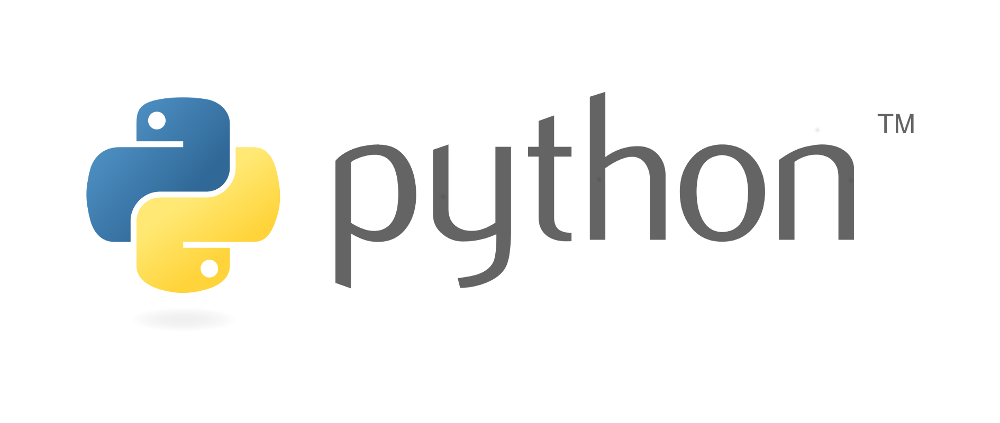
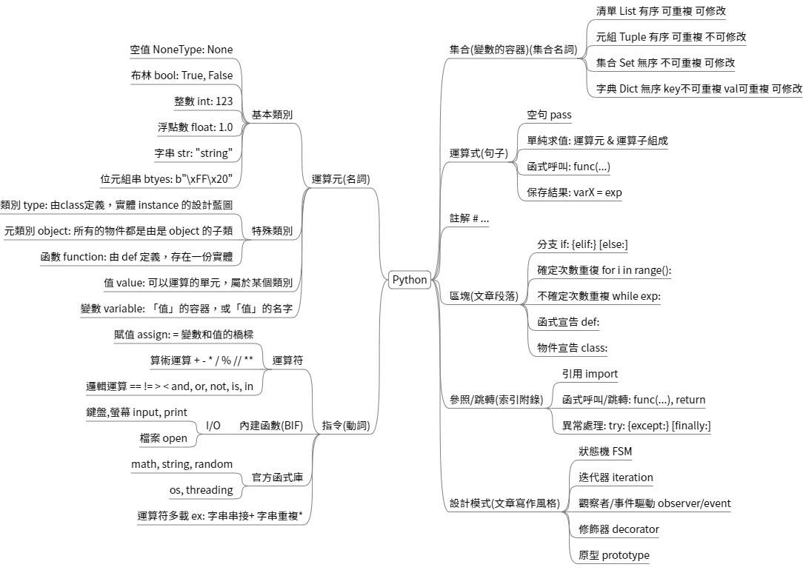

# 全民瘋AI系列 [Python從零開始]
## 關於 Python
Python 是當今世界上最流行且廣泛使用的程式語言之一，以其簡單易學和強大功能而著稱。無論是初學者還是專業開發者，Python 都是一個理想的選擇，因為它能夠應用於各種領域，從網路開發到資料科學，甚至是人工智慧和機器學習。

## Python 名稱的由來 
Python 的創造者是荷蘭的程式設計師吉多·范羅蘇姆 (Guido van Rossum)。1989 年的聖誕節期間，他決定花三個月的時間設計一種新的程式語言，旨在解決當時一些程式語言的缺點。這個專案後來成為了 Python。名字的靈感來自於吉多非常喜愛的一個英國電視喜劇團體——蒙提·派森 (Monty Python)，因此他決定將這個語言命名為 "Python"。

## Python 的特色
Python 是一種功能強大的直譯式、高階通用程式語言。它支援多種程式設計範式，包括結構化、程序式、物件導向、函數式和反射式編程。Python 採用動態型別系統和自動記憶體管理，使得開發者無需過於關注低層次的細節，而能專注於實現程式的邏輯。

- 簡潔易讀: Python 的語法設計非常簡潔，讓程式碼的可讀性和維護性極高，適合初學者快速上手。
- 強大的社群支援: 擁有全球活躍的開發者社群，提供豐富的資源和支持，無論是學習還是解決問題，都能找到合適的答案。
- 龐大的標準庫: Python 的標準庫涵蓋了從網路、文件處理到資料庫管理、GUI 開發等各個方面，為開發者提供了多種開箱即用的功能。
- 豐富的第三方庫: 無論你需要進行資料科學分析、網路開發，還是構建人工智慧模型，都能找到合適的第三方庫來加速開發。
- 應用範圍廣泛: Python 被廣泛應用於資料科學、自動化測試、網站開發、軟體開發、商業應用、多媒體處理等領域，是一個真正的通用語言。

## Python 可以做什麼？
Python 的應用領域極其廣泛，以下是一些主要的應用場景：

- 網路爬蟲與資訊擷取: 利用 Python 可以輕鬆構建網路爬蟲，從網站上自動擷取資料，並進行後續處理。
- 數據處理與視覺化: Python 提供了如 Pandas、NumPy 和 Matplotlib 等強大的工具，用於數據處理、分析與視覺化展示。
- 機器學習與人工智慧: Python 是構建機器學習模型和人工智慧應用的主流語言，擁有如 TensorFlow、PyTorch 等多種框架。
- 自動化測試: 利用 Python 可以進行軟體測試自動化，節省大量人力和時間。
- 網站開發: Django 和 FastAPI 等 Python 框架使得網站開發變得簡單而高效。
- 軟體開發: Python 不僅適合小型應用開發，也能支撐大型軟體項目，具備極高的可擴展性。
- 商業應用: Python 在商業領域中廣泛應用，從ERP系統到金融分析，均有它的身影。
- 多媒體應用: Python 可用於音訊、視訊處理，甚至是圖像生成與編輯，提供了豐富的多媒體處理工具。

## Python 學習地圖
這張學習地圖作為一個指南，提供了學習Python的系統化路徑。根據這個地圖，你可以有條理地學習Python，從基礎到進階，逐步掌握這門強大的程式語言。

